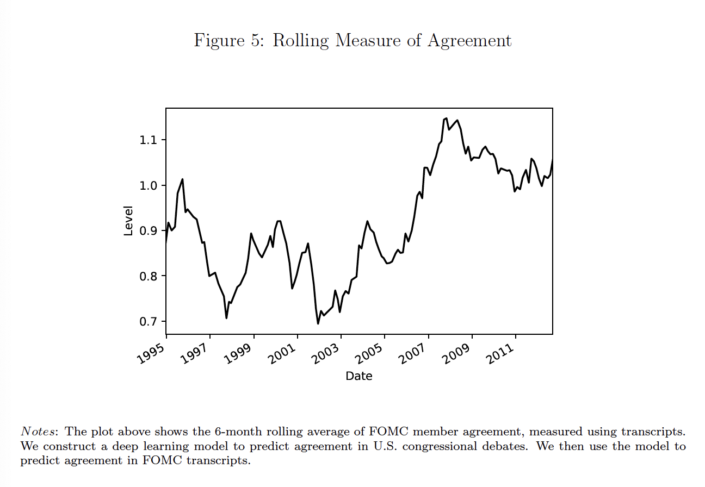
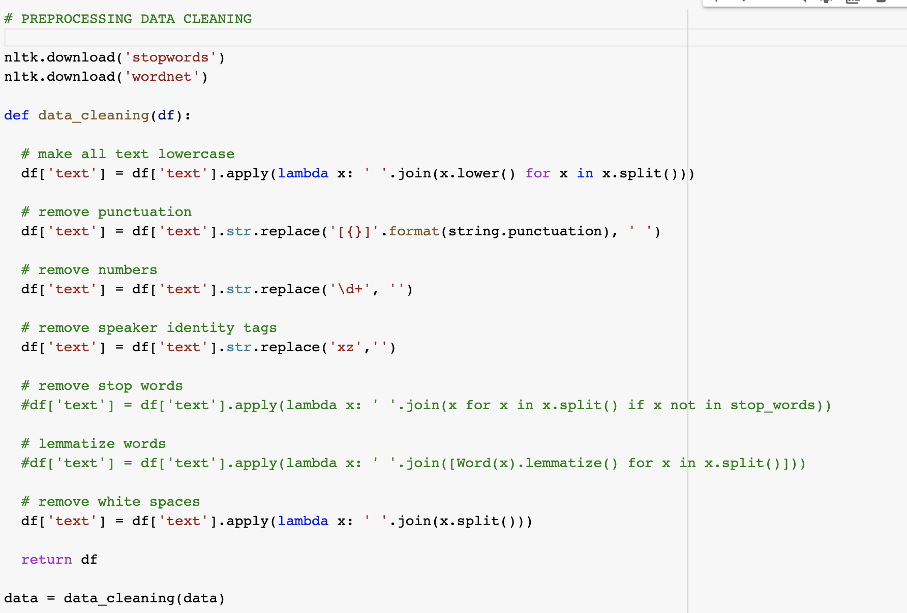
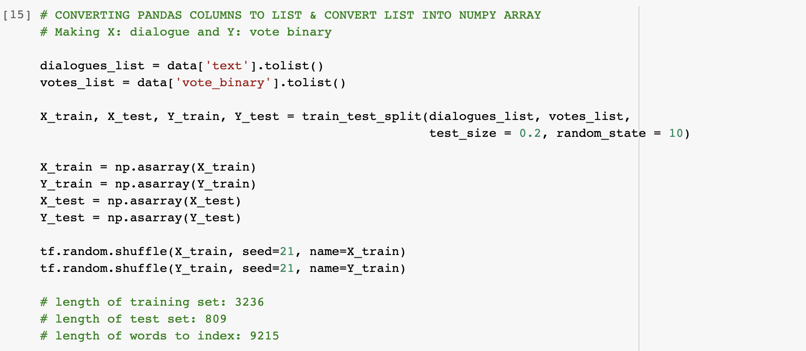
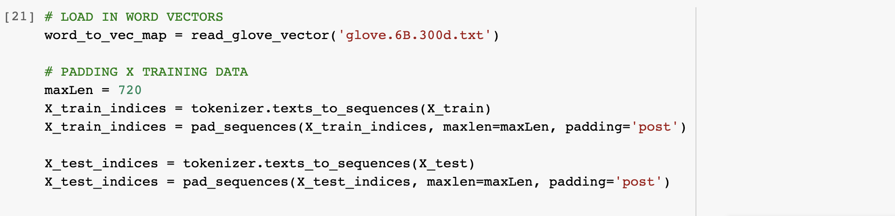
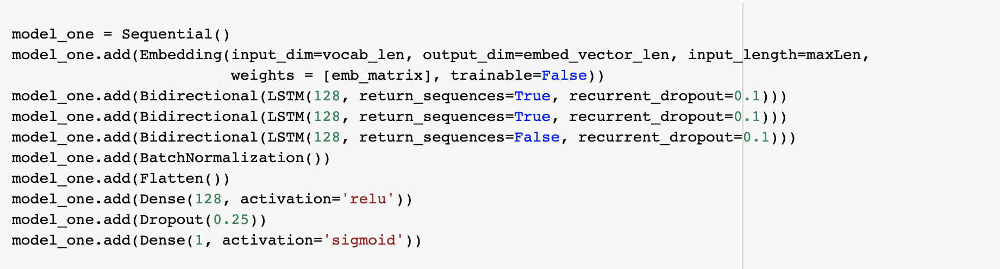
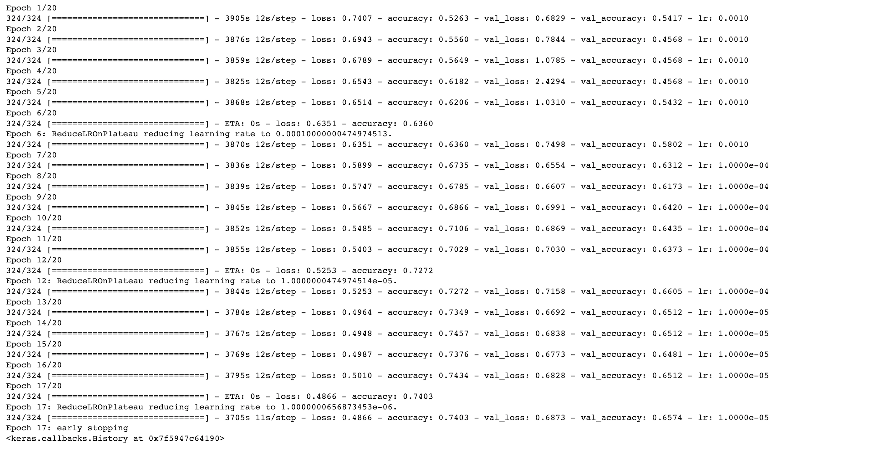
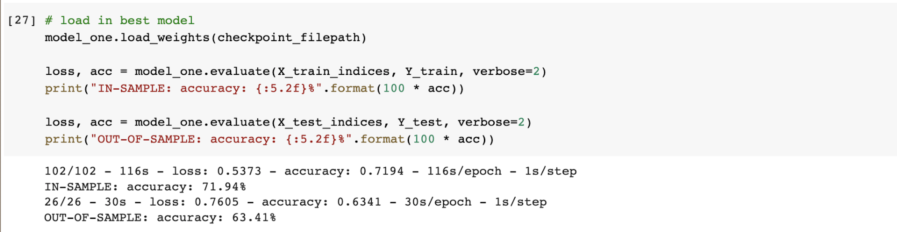
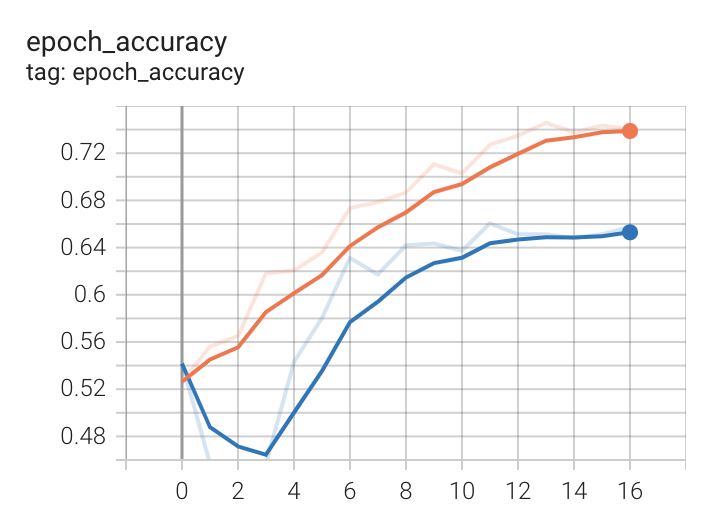

# Agreement/Disagreement LSTM model on Federal Open Market Committee Meeting Transcripts

In this project we will be replicating a 2019 paper by Mikael Apel, Marianna Blix Grimaldi and Isaiah Hull from Sveriges Riksbank (Central Bank of Sweden), titled, ["How Much Information Do Monetary Policy Committees Disclose? Evidence from FOMC's Minutes and Transcripts."](https://onlinelibrary.wiley.com/doi/10.1111/jmcb.12885) This paper is in the field of central bank communication, monetary policy and machine learning. This paper does not have any scripts attached to it, so we will be intepreting the methedology from the paper to recreate their results. 

We will investigate a specific part of this paper; the section measuring agreement and disagreement in Federal Open Market Committee meeting transcripts. In the paper, they measure agreement by performing deep transfer learning, a technique that involves training a deep learning model on one set of documents - U.S. congressional debates - and then making predictions on another: FOMC meeting transcripts. This is because of FOMC meeting transcripts are unlabeled. Overall, the paper finds that transcripts are more informative than minutes and heightened committee agreement typically preceds policy rate increases.

The deep learning model to predict agreement using U.S. congressional debate corpus that contained a vote(yes or no) label that is sufficiently large. This corpus is an ideal choice because it associates speech text with a vote that indicates whether a speaker is agreeing or disagreeing with a bill. After training the deep learning model to achieve high out-of-sample prediction accuracy, we then use it to classify text from FOMC transcripts, thus giving us a novel measure of committee agreement. (Apel 2019)

The goal of this project is to recreate the Apel 2019 paper's Figure 5, shown below.  

## Model Details

We base our model architecture on the details outlined in the Apel 2019 paper. The paper employs a "transductive" form of transfer learning. More specifically the paper uses a neural network with a long short term memory (LSTM) architecture and word embeddings. The deep learning model takes a sequence of word vectors and converts them into integer indices. The embeddings are then connected to a layer of long short term memory cells. We then flatten the output from the LSTM cells in a vector and connect them to the output layer via a dense layer. The model uses a binary crossentropy loss function and encode; agree as 1, and disagree as 0. The model uses rectified linear activation fuctions on all the hidden layers and apply 25% dropout to the final dense layer. Using the adam optimizer, we train the model on 80% of the training sample and 20% on the validation sample. The final model accuracies from the paper are 68% in-sample and 65% out-of-sample. The paper notes that these values are derived from the classification of all statements, whether or not they contain signs of agreement; in many cases the model is roughly indifferent for such statements and generates a probability of agreement near 0.5.

After training of the U.S. congressional debate data, we use the model to generate probabilities of agreement for each FOMC member's statements in the meeting transcripts. Then we average over the statements to compute a mean probability for the entire meeting transcript. 

Here is an example of the training dataset from the U.S. congressional debate dataset.

***Train Set:*** *I thank the gentleman for yielding me this time and for his great work on this bill. Mr. chairman, this country needs to create a new energy landscape that begins shrinking our disproportionate reliance on foreign energy sources and begins building one that places American ingenuity, producers and consumers at the forefront. I want to highlight one provision and that is the provision that signi cantly strengthens the important leaking underground storage tank program. The bill increases state funding... I urge their support and the support of the bill.*

Here is an example from the test dataset from the FOMC meeting transcripts. 

***Test Set:*** *Based on research from my staff, I have also lowered my estimate of ... real gdp growth ... reflecting expectations of trend growth for both the labor force and labor productivity.*

## Environment Setup & Downloads

In our model, we will use Stanford Glove word embeddings. To download the word embeddings to run the code yourself, please download the Wikipedia + Gigaword glove.6B.zip from [https://nlp.stanford.edu/projects/glove/](https://nlp.stanford.edu/projects/glove/). For this project I have used the 300 dimension version.

For the development environment I used the GPU Hardware accelerator and High-RAM runtime shape from google colab pro. However, due to the 24 hour run time constraints, I did the final run of the model training on Cedar Compute Canada GPU servers. The reason we use Cedar and not Graham, Beluga or Narval is because Cedar is the only server that allows for internet access, allowing us to use services such as wandb (Weights & Biases). 

Here are the list of packages we will be using for this project: pandas, numpy, nltk, os, random, re, string, textblob, wordcloud, sklearn, matplotlib, keras, tensorflow, time, datetime, & pickle

## Data Preparation

We need to prepare two datasets, the U.S. congressional debate dataset and the FOMC meeting transcripts dataset.
Let's first start by preparing the U.S. congressional debate dataset.

The source of the U.S. congressional debate dataset is a paper from the EMNLP 2006 journal. The paper is titled ["Get Out the Vote: Determining Support of Opposition from Congressional Floor-Debate Transcripts"](https://www.cs.cornell.edu/home/llee/papers/tpl-convote.home.html) by Thomas M., B.Pang and L.Lee.

First let's check if the GPU and RAM is running properly. 
 
 

Then load in the U.S. congressional debate dataset.  
 

Let's get some statistics on our debate dataset.
- The max length of each speech segment in the U.S. congressional debate data is 702 characters long.
- The total number of unique words in the U.S. congressional debate corpus is 10621 words.
- Number of speech segments and labels in U.S. congressional debate dataset is 4045.
- 56.864% of the U.S. congressional debate dateset is Yes labeled speech segments.
- 45.36% of the U.S. congressional debate dateset is No labeled speech segments.

Our U.S. congressional debate dataset is sufficiently large, and the classes in the dataset are fairly balanced.

Now lets remove the irrelevent frequent words from the data. 

Currently, our debate data currently looks like this. 

Then remove one sentence speeches that that include the word "yield" once. 

Now, lets do some data cleaning. We will make all text lowercase, remove punctuation, remove numbers, remove speaker identity tags, and remove double white spaces. We will not remove stop words as the paper did not indicate to remove them.  

## LSTM Model Building

Let's prepare the debate dataset for model training.
First convert the pandas columns into list, then convert them into a numpy array. 

Then initialize the tokenizer and create a word index. 

Let's check on our training, test dataset and the words to index object.
- Length of training set: 3236
- Length of test set: 809
- Length of words to index: 9215

Now prepare a function that maps the words to a glove word embedding. 

Load in the word vectors and pad the training and text data to make them the same length. 

Then define an embedding matrix. 

Then define some names to make sure you can differentiate between your different models and saves. Also define callbacks, loggers, early stop and reduced learning rate mechanism. 

Now lets not forget to set up tensorboard so we can actually see how our training looks like.  

## LSTM Model Training

Now define the LSTM model as per the Apel 2019 paper descriptions. 

Here is the model summary.  

Now define the optimizer. 

Then finally fit the model to the dataset.  

Here is the output during the training process.

Then load in the model with the best validation accuracy. And check the in-sample and out-of-sample accuracy. 

Lastly, here is the training and validation accuracy over epochs.

